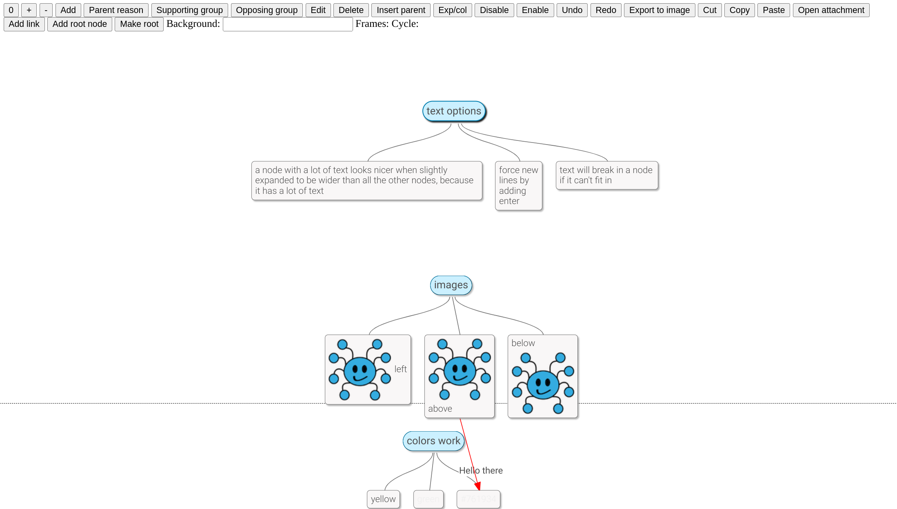

# MindMup MapJs

MindMup is a zero-friction mind map canvas. Our aim is to create the most productive mind mapping environment out there, removing all the distractions and providing powerful editing shortcuts.

||
|----------------------------|

This project is the JavaScript visualisation portion of MindMup. It provides a canvas for users to create and edit mind maps in a browser. You can see an example of this live at [mindmup.com](http://www.mindmup.com), or play with the library directly in the browser using `test/index.html` from this project.

This project is relatively stand alone and you can use it to create a nice mind map visualisation separate from the [MindMup Server](https://www.mindmup.com).

## Using MAPJS standalone

To run the dev server, execute:

`npm run start`

Then open <http://localhost:9000/> to view the example map.

## Using MAPJS in your projects

MapJS 2 works well with WebPack. Check out the [MAPJS Webpack Example](https://github.com/mindmup/mapjs-webpack-example) project.

Or just use: `npm run pack`

## Using MAPJS with argmap

argmap integrates with MAPJS:

[argmap](https://github.com/s6mike/argmap/tree/master)

Though currently, most of this integration is not on the main branch.

## Testing

To run the unit tests, execute

    `npm test`

To debug and try things out visually, grab the dependencies using:

    `npm run pretest`

## Dependencies

This library depends on the following projects:

- [JQuery](http://jquery.com/)
- [Underscore.Js](http://underscorejs.org/)
- [JQuery HotKeys](http://jquery.com/)
- [Hammer.JS JQuery Plugin](http://eightmedia.github.com/hammer.js)
- [Color JS](https://github.com/harthur/color)

## Node Selection

- You can only select one node at a time, selected nodes have a drop shadow.
  - When you add nodes they are added relative to th selected node.
- You can activate multiple nodes at once, these are highlighted with a dotted line.
  - When you delete or toggle nodes, this affects all active nodes.

## Node Editing

- New nodes automatically give you text focus so you can start adding its initial text.
- Clicking on a node twice lets you edit the node's text.
- Typing in a url will add a clickable link icon to the node allowing you to open that url in another tab. The url's text will not be displayed in the node except when editing it.
- You can add an image to a node by dragging a file or web page image into it.
- Click `open attachment` button to open `add attachment` pop-up.

## Links

- Links are arbitrary straight line connections between nodes that are not part of the tree structure.
- You can create them with `alt+click` or with the `add link` toolbar button.
- You can select links by clicking on them:
  - This displays the Edit Link buttons underneath the main toolbar buttons:
    - These can be used to delete the link or change their colour, style or toggle an arrow.
  - The selected link is highlighted with a dotted purple line.

## Mouse Operations

- Click inside a node to select it.
- Click twice inside a node to edit the text.
- `shift+click`: Activates a node.
- Menu Toolbar at top has buttons for a number of operations, yet to be documented.
- Dragging and dropping:
  - Root nodes only: drag into an open space to re-position.
  - Child nodes: Make it into a new root node by dragging it into open space.
  - Re-order nodes by dragging and dropping onto another node: you will see a red dotted highlight around the target node.
  - You can drag images from files or other web pages into the map, either into existing nodes, or into open space to create new nodes.
  - You can drag `.mup` files or `.json` files (which contain the `.mup` data structure) into a container to paste the file contents.
    - ISSUE: Only supports the same features as paste, so does not currently support links or themes.
- `alt+click` on a node adds a link from your currently selected node to the clicked node.
- Clicking on a link icon opens up the url in a new tab.
- Clicking on an attachment icon opens the `add attachment` pop-up.

## Keyboard Shortcuts

| Key Combination | Normal Horizontal Maps | Top-Down Maps |
|-----------------|----------------------------|---|
`return`  | Add sibling node after | Add child node after
`shift+return` | Add sibling node before | Add parent node
`tab` `insert`  | Add child node | Insert sibling node after
`shift+tab` | Insert parent node | Insert sibling node before

| Key Combination | Effect |
|-----------------|---|
`shift+return` *while editing node text* | Start new line of text
`space` `f2` | Edit text of currently selected node
`del` `backspace` | Delete active nodes
`alt+click` | Add link to clicked node
`down` | Select node below
`up` | Select node above
`left` | Select node left
`right` | Select node right
`shift+click` | Activate clicked node
`shift+down` | Activate node below
`shift+up` | Activate node above
`shift+left` | Activate node left
`shift+right` | Activate node right
`meta+down` `ctrl+down` | Move active nodes below
`meta+up` `ctrl+up`| Move active nodes above
`meta+right` `ctrl+right` | Move active nodes right
`meta+left` `ctrl+left` | Move active nodes left
`c` `meta+x` `ctrl+x` | Cut
`p` `meta+v` `ctrl+v` | Paste
`y` `meta+c` `ctrl+c` | Copy
`ctrl+shift+v` `meta+shift+v` | Paste Style (custom colours)
`f` `/` | Toggle collapse / reveal
`u` `meta+z` `ctrl+z` | Undo
`r` `meta+shift+z` `ctrl+shift+z` `meta+y` `ctrl+y` | Redo
`meta+plus` `ctrl+plus z` | Zoom in
`meta+minus` `ctrl+minus` `shift+z` | Zoom out
`esc` `0` | Activate root node of current selected tree, centre screen on it and reset zoom
`1-9` | Activate all nodes at that level (in all trees)
`[` | Activate descendants
`{` | Activate node and descendants
`=` | Activate sibling nodes
`.` | Deactivate all but selected node
`a` `click on paperclip icon` | Add / Open attachment
`click on link icon` | Open url
`i` | Edit icon *(Reserved - doesn't currently do anything)*
